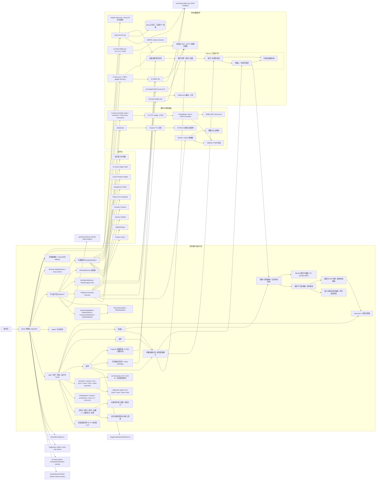

# 救援机器人控制台

救援机器人控制台是一个面向救援机器人调试、远程控制和现场测试的本地 Web 工具。当前系统包含 React 控制台、平台运行层、内置插件包、Feetech 舵机总线、TB6618/PWM 电机控制、摄像头云台、机械臂示教、树莓派 SSH 远控、固件刷写助手和本地数据服务。

## 快速运行

```powershell
cd web
npm.cmd install
npm.cmd run dev
```

常用本地服务：

```powershell
cd web
npm.cmd run data-service
npm.cmd run firmware-helper
npm.cmd run pi-helper
```

常用验证：

```powershell
cd web
npm.cmd run build
npm.cmd test
npm.cmd run health
```

## 架构图

<!-- ARCHITECTURE:BEGIN -->

<!-- ARCHITECTURE:END -->

## Stepwise Merge Refactor Notes

- Camera rendering now goes through `web/src/domains/camera/CameraSourcePanel.tsx`, shared by the drive page and console dashboard camera panels.
- Panel layout primitives live in `web/src/platform/panelLayoutCore.ts`; `architecture.ts` re-exports the same API for compatibility.
- Plugin auto-detection hardware scanning lives in `web/src/domains/plugin-auto-detect/detectors.ts`; the panel only manages phases, cancellation, rendering, and auto-add.
- Local helper HTTP basics live in `web/local-services/local-http-helper.mjs` and are shared by `data-service.mjs`, `firmware-helper.mjs`, and `pi-helper.mjs`.
- `pi-helper.mjs` is the SSH/SFTP management plane and now schedules operations by resource: default Pi management is serialized per host, camera management is serialized per host/port, and repeated camera checks use latest-wins pending request replacement. Real-time motor/servo traffic stays on the persistent Pi HTTP bridges, and video frames stay on direct MJPEG/WebRTC stream URLs.
- `pi-image/install-rescue-pi.sh` is the Pi image initialization entrypoint. Run it during image provisioning or once on an already flashed Pi to install both bridge scripts under `/opt/rescue-robot/bridges/`, enable `a-board-serial-bridge.service` on `17353`, and enable `pi-servo-serial-bridge.service` on `17354`.
- A-board runtime control is now semantic on the PC/Pi path: the web app sends `motor.target`, `mecanum.target`, and `can_servo.*` intent to the Pi bridge, the Pi bridge forwards one UART JSON line, and the Type A firmware owns motor closed loop, mecanum mixing, ASMG-MD CAN frame generation/parsing, and latest-wins motion dropping.
- AI Vision is an external local helper shell: the web app sends `streamUrl`, `sourceId`, and platform state to `web/local-services/ai-vision-helper.py`, which pulls MJPEG frames and returns normalized `competition_mannequin` detections or captured samples.
- Diagnostic copilot v1 is a local rule-based side panel: it reads `DeviceStateSnapshot`, logs, camera sources, and current servo/motor lists, then can automatically dispatch only low-risk diagnostic `PlatformCommand` checks while leaving motion, write, upload, and arbitrary Pi commands as manual/confirmation-only suggestions.
- Display formatting helpers live in `web/src/shared/formatters.ts` for dashboard, platform state, and app metric formatting.
- 顶部状态栏只保留 Pi 远控、舵机桥接和 A 板桥接这类可操作连接卡；串口连接、调试模式、配置保存、项目、保存详情和模块摘要不再作为全局状态卡常驻展示。
- 主控台仪表盘头部采用紧凑工具条：标题、机器人选择和布局操作在桌面端单行排列，窄屏自动堆叠，减少首屏空白高度。
- Three-layer workspace primitives and pure helpers now live in `web/src/workspaces/architecture/ArchitectureWorkspacePrimitives.tsx` and `web/src/workspaces/architecture/architectureWorkspaceUtils.ts`.
- Production TypeScript builds exclude `src/**/*.test.ts(x)`; Vitest remains responsible for test files.
- Vite splits lazy workspaces and large vendors into route/vendor chunks; Blockly and Three remain intentional lazy-loaded large library chunks with the warning threshold set to 700 kB.

## 主要模块

- `web/src/App.tsx`：极薄入口，直接导出 `web/src/app/AppShell.tsx`。
- `web/src/app/*`：控制台外壳、导航、持久化、串口/平台/反馈运行时和工作区组合逻辑。
- `web/src/workspaces/*`：页面级工作区，包含主控 dashboard、架构三层页、驾驶页、树莓派远程页和 CAN 舵机测试页；串口连接与调试开关属于功能测试上下文，由测试页分段栏承载，不再作为全局常驻操作。
- `web/src/domains/*`：按业务领域收拢的摄像头、机械臂、舵机、电机、底盘、机器人装配和插件自动检测模块；机械臂面板包含 2D FK/IK 与调参建议 UI。
- `web/src/workspaces/architecture/ThreeLayerWorkspace.tsx`：插件库、组件库和机器人运行面板，由架构页按需加载，按入口 `layer` 分别渲染；创建插件、组件和机器人使用折叠创建向导，收起态变为 56px 左侧 rail，让右侧库和运行面板横向扩展；插件页按设备类型、品牌、代码库顺序创建真实插件实例，插件库使用格子布局并支持删除未占用实例，点开舵机/电机实例会显示从功能测试迁入的单实例调试面板；Feetech 舵机详情包含限位、复位、逻辑中位和带确认的物理 ID 写入。
- `web/src/domains/robot-assembly/RobotAssemblyWorkspace.tsx`：机器人装配画布、素材栏、检查器、动作按钮和 Blockly 图形化程序面板；桌面布局为左侧素材栏、右上画布、右下检查器，素材栏可一键收缩为组件、插件、硬件图标栏，收起后画布和检查器同步横向扩展；检查器内嵌的舵机/电机等插件调试面板按可用宽度自适应端口映射、预览格和操作按钮，避免把工作区撑出横向滚动；可见文案通过 `robotText` 兜底，避免 `robotAssembly.*` key 泄漏，并将结构检查里的内部 ID 和英文校验消息压缩成更适合操作员阅读的提示；图形化程序保存为 `RobotProgram`，首版固定在 PC/浏览器端编译成 `WorkflowDefinition` 后执行。
- `web/src/platform/*`：平台模型、命令、执行器、事件、插件注册、设备拓扑、状态快照和 UI schema helper。
- `web/src/platform/architecture.ts`：三层架构纯模型，包括驱动库派生、设备目录、插件实例、组件、机器人、面板布局、唯一占用校验和旧驱动 profile 兼容桥。
- `web/src/plugins/builtin/*`：内置能力、驱动、传输和设备面板 schema，包括舵机、电机、摄像头、机械臂、树莓派和固件刷写。
- `web/src/adapters/*`：外部接口与持久化适配器，包括硬件协议、WebSerial、树莓派远控、固件助手和数据服务客户端。
- `web/src/styles/*`：按页面和能力拆分的样式入口，由 `web/src/App.css` 聚合。
- `web/local-services/*`：本地数据服务、三层资产 SQLite schema、固件刷写助手、树莓派 SSH helper 和文档同步检查。
- `web/local-services/health-check.mjs`：只读项目健康检查，汇总最大源码文件、`any` 使用量、测试声明数、构建 chunk 体积、UTF-8 文档状态和常见乱码片段。
- `firmware/`：ESP32/PlatformIO 固件，负责 JSON 控制器、PWM 电机和 Feetech 总线桥接能力。
- `docs/`：协议和设备接线说明。

## 平台化约定

- UI 层优先通过 `PlatformCommand` 表达设备动作，`dispatchPlatformCommand` 统一进入 `executePlatformCommand`。
- 图形化编程首版通过 Blockly 编辑受控 DSL，保存到机器人 `config.programs`，运行时只派发 `PlatformCommand`；树莓派离线 runner 和 A 板固件下放留作后续阶段。
- 插件实例是物理设备实例，组件和机器人装配必须通过 SQLite 数据服务保存；浏览器 IndexedDB 只作为旧配置 fallback。
- 插件、组件、机器人和功能测试的通用平台控制区优先使用 `UiPanelSchema` 渲染，三层平级页面会按插件能力自动生成并保存可拖动面板。
- 设备能力通过 `DeviceDescriptor`、`DeviceStateSnapshot`、`UiPanelSchema` 和内置插件描述。
- 保持现有硬件协议、串口波特率、Feetech 二进制帧、ESP32 JSON 命令和项目数据结构兼容；物理舵机 ID 写入只在 Feetech 直连总线下作为高级操作执行，逻辑中位保存到插件/机械臂配置。

## 文档同步规则

任何代码、脚本、固件、配置或协议变更，都必须同步更新本 README，并更新上方 Mermaid 架构图。`npm.cmd test` 会运行 `web/local-services/check-doc-sync.mjs`；当发现非 README 的 tracked 变更但 README 或架构图区块未同步变化时会失败。

## 硬件默认链路

- 舵机测试：默认现场链路为 Web UI -> 树莓派 `pi-servo-serial-bridge.service` -> `/dev/serial0 @ 115200` -> Bus Servo Driver HAT(A) ESP32 transparent firmware -> Feetech STS/SCS 舵机；浏览器 WebSerial -> USB/TTL Feetech 总线适配器仍保留为 `1000000 baud` 直连调试路径。
- RoboMaster A 板测试：Web UI -> 树莓派 `a-board-serial-bridge.service` -> `/dev/ttyAMA5 @ 115200` -> A 板 `PD5/PD6 USART2`；树莓派物理引脚固定为 `30 GND / 32 TXD5 / 33 RXD5`。当前 A 板电机固件默认打开四路 WHEELTEC G513XL/TB6618：M1 A 左前 `PA0/PB0/PE12 + PE4/PF0`、M2 B 左后 `PA1/PC2/PE6 + PE5/PF1`、M3 C 右后 `PA2/PA4/PC1 + PC0/PB1`、M4 D 右前 `PA3/PA5/PC5 + PC4/PC3`，公共 `STBY=PD12`。
- 控制器模式：Chrome/Edge WebSerial -> ESP32 JSON 控制器，默认 `115200 baud`。
- 数据服务：`127.0.0.1:17351`，默认 SQLite 路径为 `%USERPROFILE%\.rescue-robot\rescue-robot.sqlite`。
- 固件刷写：本机 `firmware-helper.mjs` 调用 PlatformIO 编译和上传。
- Pi image bridge provisioning: `pi-image/install-rescue-pi.sh` installs the two persistent Pi bridge services during image build or first boot. Runtime bridge checks and commands go directly to `http://<pi-host>:17353` and `http://<pi-host>:17354`; the Pi remote panel's upgrade/repair buttons use `pi-helper` SSH only as a manual recovery path.
- A-board semantic runtime path: PC/Web sends high-level `PlatformCommand` intent, `appPlatformCommandBridge.ts` converts wheel/servo/motor actions to one A-board semantic JSON command, `a-board-serial-bridge.service` forwards it over `/dev/ttyAMA5`, and the Type A firmware performs closed-loop motor control, mecanum mixing, CAN-servo frame generation, and latest-wins motion dropping.
- 树莓派 helper：本机 `pi-helper.mjs` 通过 SSH/SFTP 执行上传、运行和摄像头相关命令；树莓派远程面板可手动保存完整远程配置，避免每次重新输入；无屏找回优先扫描 `rescue-pi.local`、`10.12.194.1` 和 `10.43.0.1`，并可通过 SSH 配置 USB-C gadget 直连。

## Dual Camera Notes

- Main camera source: `camera:main`, `/dev/video0`, port `8080`, `http://<pi-host>:8080/stream`.
- Second camera plugin: `camera:secondary`, `/dev/video1`, port `8081`, `http://<pi-host>:8081/stream`, video-only.
- The main control page can switch the active source or use the dual layout to display both streams together. Gimbal movement stays bound to `camera:main`.

## Local Browser Camera Notes

- Computer camera plugin: `builtin.browser-camera`, driver `driver.browser-camera`, transport `transport.browser-media`.
- The plugin page preview uses `navigator.mediaDevices.getUserMedia()` and browser camera permissions.
- Local browser camera preview stays in the plugin/three-layer workspace and does not add a main-control video source.
